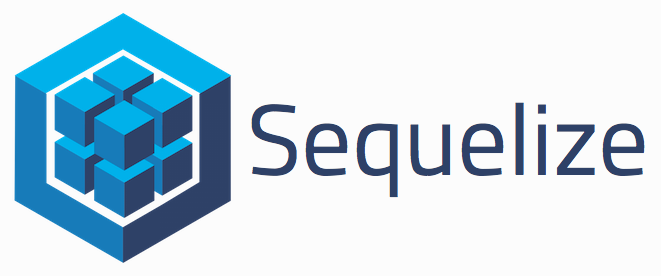

# tasklist-crud-api

このリポジトリは Code Chrysalis の生徒であるときに作成しました（This was created during my time as a student at Code Chrysalis）

crud-api for task data

##利用したサービス
Node.js

https://nodejs.org/ja/

express

https://expressjs.com/ja/

express-validator

https://express-validator.github.io/docs/

Sequelize  
  
https://sequelize.org/master/
